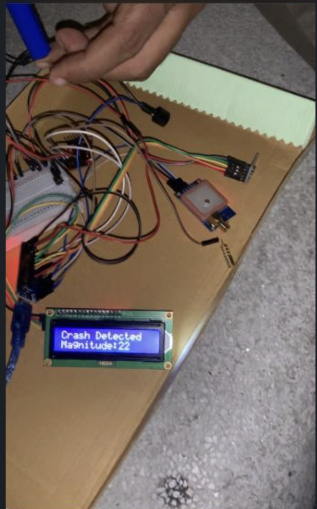
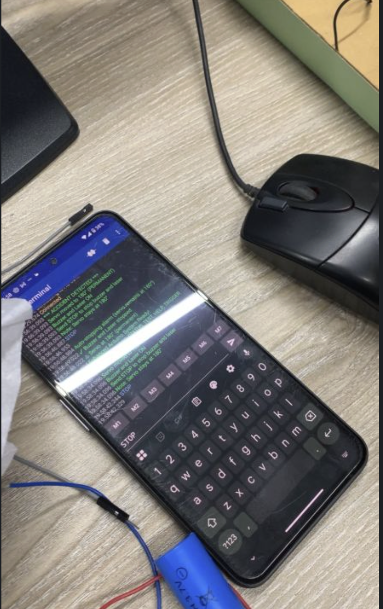
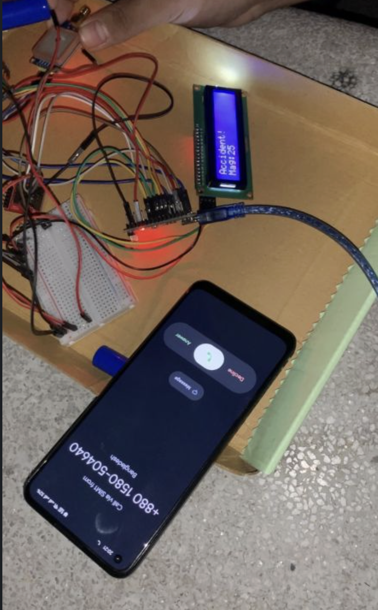
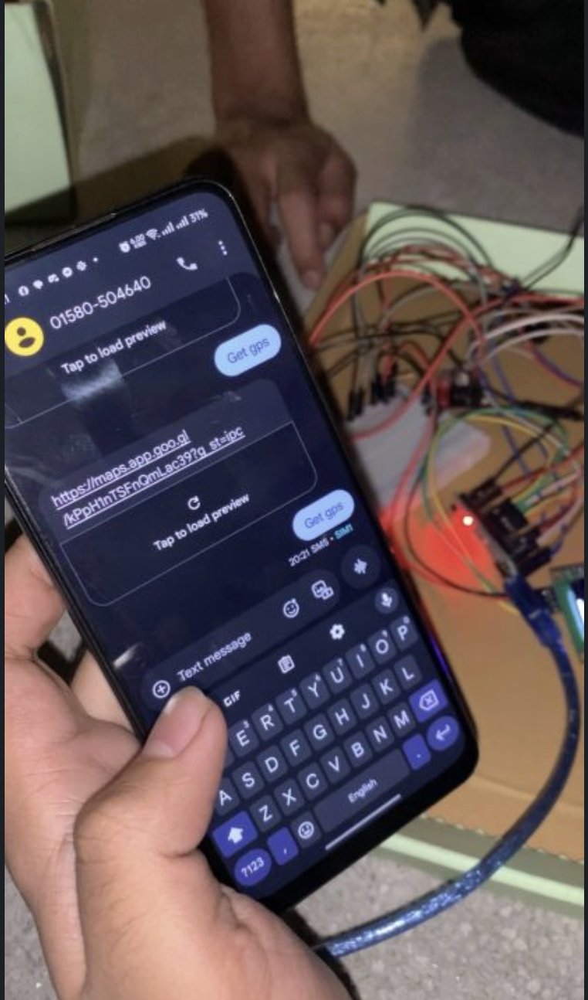
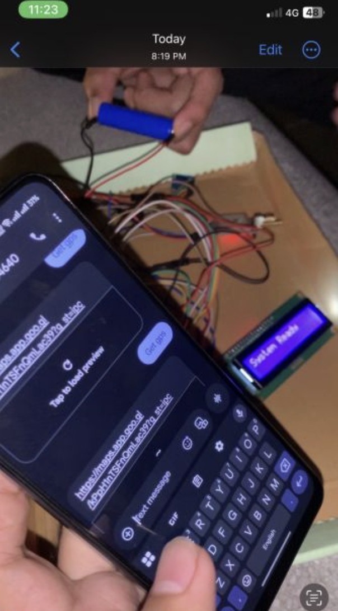
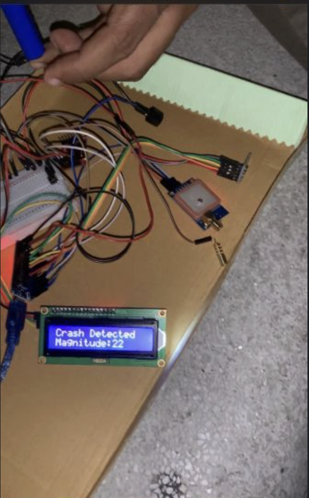
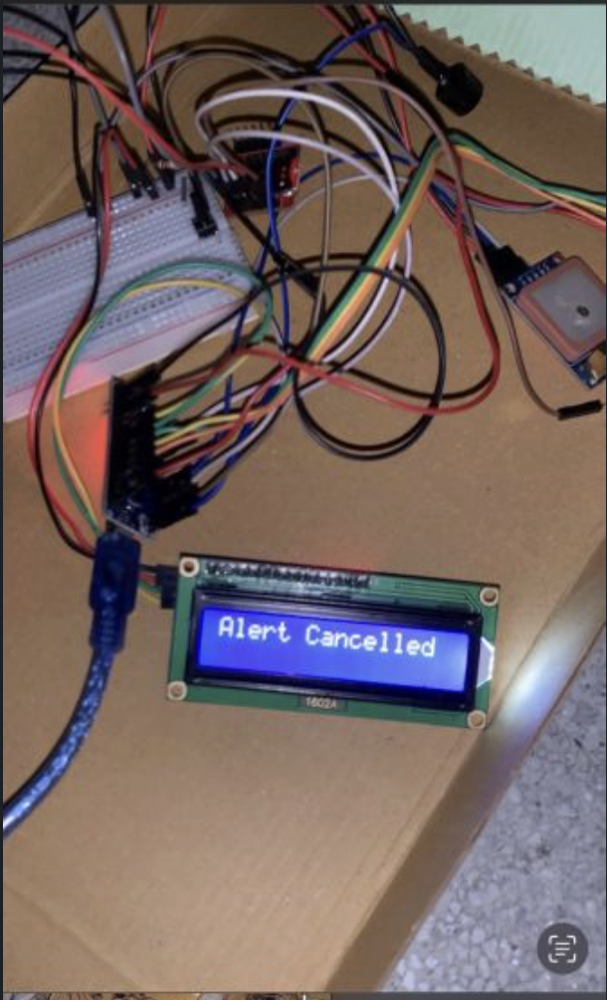

# 🚨 Accident Detection and Alert System for Bikes and Cars

Last semester, I developed an **Accident Detection and Alert System** as part of my Computer Interfacing Project. This Arduino-based system is designed to detect vehicle accidents using motion and orientation sensors, and instantly send emergency alerts—including the exact GPS location—via SMS and call.

The system is packed with safety features such as automated emergency notifications, local alerts, and smartphone control via Bluetooth. It provides a real-time, reliable solution to enhance road safety for bikes and cars.

---

## 📸 Project Preview

<div align="center">
  
  
  
  
  
  
  
</div>

*Complete accident detection system with sensors, GPS, GSM, and alert mechanisms*

---

## 💡 How It Works

The system continuously monitors vehicle orientation and acceleration. If it detects a crash, it triggers:
* **Local alerts** using a buzzer, laser, and servo motor (vehicle lock simulation)
* **Remote alerts** by sending SMS with a Google Maps location link and initiating an emergency call
* **Manual reset** options to prevent false alarms

---

## 🔧 Key Components & Features

| Component               | Function                                               |
| ----------------------- | ------------------------------------------------------ |
| **Accelerometer**       | Detects sudden impact or motion changes                |
| **Tilt Sensor**         | Detects vehicle tipping or falling                     |
| **GPS Module (Neo-6M)** | Captures real-time coordinates                         |
| **GSM Module (SIM800)** | Sends SMS, makes emergency calls                       |
| **Bluetooth Module**    | Enables commands like STOP, RESET, TEST, TRIGGER, HELP |
| **LCD Display (I2C)**   | Displays system status in real time                    |
| **Buzzer + Laser**      | Immediate local audio/visual alerts                    |
| **Servo Motor**         | Simulates vehicle lock during accident                 |
| **Emergency Button**    | Allows manual reset in case of false trigger           |

---

## 🛠️ Software & Libraries Used

* **Microcontrollers:** Arduino UNO, Arduino NANO
* **Libraries:**
  * `SoftwareSerial`
  * `AltSoftSerial`
  * `TinyGPS++`
  * `LiquidCrystal_I2C`
  * `Servo.h`
  * `Wire.h`
  * `math.h`

---

## 🔄 System Workflow

1. **Detection:**
   * Accelerometer and tilt sensor constantly monitor motion and orientation.
2. **Immediate Alerts:**
   * If an accident is detected, the system triggers the buzzer, laser, servo lock, and Bluetooth alert.
3. **Emergency Response:**
   * GPS fetches the location
   * GSM module sends an SMS with a Google Maps link
   * An emergency call is automatically placed
4. **Manual Control:**
   * Emergency button or Bluetooth can reset the system in case of a false alarm.

---

## 📩 Emergency SMS Example

```
Accident detected! Location: https://maps.google.com/?q=LAT,LONG
Please send help immediately.
```

---

## 🔍 Future Scope

This project provided hands-on experience in **Arduino**, **IoT communication**, and **real-time safety mechanisms**. I'm excited to further explore advanced tech solutions that can make a real-world impact on road safety and emergency response systems.

---

## 📁 Repository Structure

```
Arduino-Accident-Detection-Project/
├── docs/                 # Project images and documentation
│   ├── 1.png
│   ├── 2.png
│   ├── 3.png
│   ├── 4.png
│   ├── 5.png
│   ├── 6.png
│   └── 7.png
├── src/                  # Arduino source code
├── circuit/              # Circuit diagrams
└── README.md             # Project documentation
```

---

## 🚀 Getting Started

### Prerequisites
- Arduino IDE (v1.8.x or higher)
- Required libraries (listed above)
- Hardware components as per circuit diagram

### Installation

1. **Clone the repository:**
```bash
git clone https://github.com/Shihabsarker93/Arduino---Accident-Detection-Project.git
cd Arduino---Accident-Detection-Project
```

2. **Install required libraries:**
   - Open Arduino IDE
   - Go to Sketch → Include Library → Manage Libraries
   - Search and install each library listed in the Software & Libraries section

3. **Upload the code:**
   - Connect your Arduino board via USB
   - Open the `.ino` file from the `src` folder
   - Select the correct board and port
   - Click Upload

4. **Configure GSM Module:**
   - Insert a working SIM card
   - Update emergency contact numbers in the code
   - Test SMS and call functionality

---

## 🎯 Bluetooth Commands

| Command    | Function                           |
| ---------- | ---------------------------------- |
| `STOP`     | Stop all alerts                    |
| `RESET`    | Reset the system                   |
| `TEST`     | Test all components                |
| `TRIGGER`  | Manually trigger accident alert    |
| `HELP`     | Display available commands         |

---

## 📝 License

This project is open-source and available for educational purposes.

---

## 👨‍💻 Author

**Md Shihab Sarker**  
Computer Science & Engineering Student  
GitHub: [@Shihabsarker93](https://github.com/Shihabsarker93)

---

## 🙏 Acknowledgments

This project was developed as part of the Computer Interfacing course. Special thanks to my professors and teammates for their guidance and support throughout the development process.
